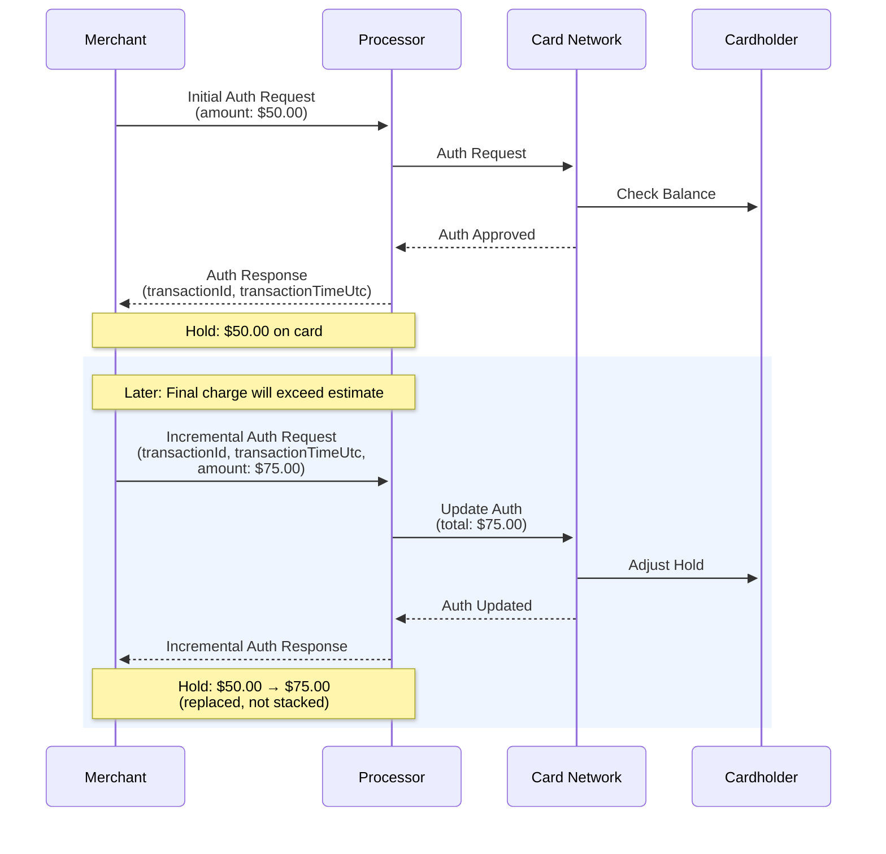

Incremental Authorization raises the hold amount on an existing pre-authorization without closing the transaction. 
Use it when the final charge is expected to exceed the original authorized amount, for example, an EV charging session that runs longer than the initial estimate.

## How it works

An Incremental Auth sends a new authorization request against an existing transaction. The `amount` field represents 
the new **total** authorized amount, not the additional delta. If you authorized \$50 and want to hold \$75, send `75.00`.

The request links to the original transaction using two fields from the original Auth response: `transactionId` 
and `transactionTimeUtc`. Both are required. The processor uses them to locate and update the existing hold.

After this call, the processor holds \$75.00 against the cardholder. The original \$50.00 hold is replaced, not stacked.

The flow looks like this:


## Request

Send the following request body to [`POST /close-transaction`](/reference/ecom/payments/close-transaction) to submit an Incremental Auth:

```json
{
  "basicInfo": {
    "requestType": 6,
    "entryMode": 1,
    "amount": 75.00,
    "currency": "USD",
    "countryCode": "US",
    "merchantRequestId": "INCR_AUTH_REQ_001",
    "transactionId": "ORIGINAL_NAYAX_TRX_12345",
    "transactionTimeUtc": "2026-03-18T15:00:00Z"
  },
  "machineInfo": {
    "machineId": "1001578171"
  },
  "cardHolderInfo": {},
  "paymentInfo": {},
  "additionalInfo": {},
  "validationKey": "<your-validation-key>"
}
```

### Parameters

The table below describes each required field in the request body:

| **Parameter** | **Type** | **Description** | **Required** |
|---|---|---|---|
| **requestType** | Int32 | Must be `6` for Incremental Auth | Required |
| **amount** | Decimal | New total authorized amount, not the delta | Required |
| **transactionId** | String | Nayax transaction ID from the original Auth response | Required |
| **transactionTimeUtc** | DateTime | UTC timestamp from the original Auth response | Required |
| **merchantRequestId** | String | A new unique ID for this incremental auth request | Required |
| **validationKey** | String | HMAC key for request authentication | Required |

## Response

A successful validation returns a `200 OK` status and a body containing the validated merchant details:

```json
{
  "status": {
    "verdict": "Approved",
    "code": 0,
    "statusMessage": "Payment processed successfully."
  },
  "basicInfo": {
    "amount": 25.5,
    "currency": "EUR",
    "merchantRequestId": "MERCHANT_MIT_001",
    "transactionId": "NAYAXTRANS98765",
    "transactionTimeUtc": "2025-08-28T10:30:00Z"
  },
  "paymentInfo": {
    "amount": 25.5,
    "currency": "EUR",
    "nayaxTokenId": "NAYAXTOK12345",
    "siteId": 1,
    "providerTransactionId": "PSP_TRANS_ABC",
    "decimalPlace": 2
  }
}
```

### Response parameters

The table below describes the parameters of the response:

| Parameter               | Location    | Type     | Description                                                             |
| :---------------------- | :---------- | :------- | :---------------------------------------------------------------------- |
| `verdict`               | status      | String   | **'Approved'** or **'Declined'**. The final decision.                   |
| `code`                  | status      | Int32    | Response code: **0 for Approved**, otherwise the relevant decline code. |
| `statusMessage`         | status      | String   | A descriptive message about the transaction outcome.                    |
| `amount`                | basicInfo   | Decimal  | The transaction amount processed.                                       |
| `currency`              | basicInfo   | String   | The currency of the transaction.                                        |
| `merchantRequestId`     | basicInfo   | String   | The unique ID from the original request.                                |
| `transactionId`         | basicInfo   | String   | The unique transaction ID assigned by the Nayax system.                 |
| `transactionTimeUtc`    | basicInfo   | DateTime | The UTC timestamp when the transaction was completed.                   |
| `nayaxTokenId`          | paymentInfo | String   | The token ID used for the charge.                                       |
| `siteId`                | paymentInfo | Int32    | The site ID associated with the payment.                                |
| `providerTransactionId` | paymentInfo | String   | The unique ID assigned by the Payment Service Provider (PSP).           |
| `decimalPlace`          | paymentInfo | Int32    | The number of decimal places used for the currency/amount.              |

<Tip>
  `transactionId` and `transactionTimeUtc` must come from the original Auth response, not the pre-auth or any intermediate request. 
  Using the wrong values will cause the processor to reject the request.
</Tip>