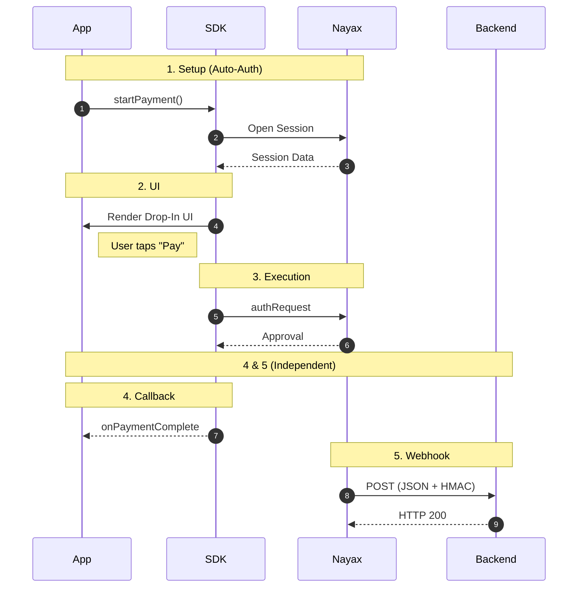

The front-end SDK enables you to integrate a payment page into your applications without directly handling complex payment processing or security. It simplifies the front-end payment experience by providing a few key methods for securely displaying and interacting with the payment page. At the same time, Nayax manages the complex interactions with the billing provider in the background.

## Payment flow

The diagram below describes the typical payment flow for a front-end integration.

<a
  href="\images\ecom-front-end-integration.png"
  download="ecom-front-end-integration.png"
  style={{
    display: 'inline-flex',
    alignItems: 'center',
    gap: '8px',
    padding: '8px 16px',
    backgroundColor: '#6352E0',
    color: 'white',
    borderRadius: '6px',
    fontWeight: '500',
    fontSize: '14px',
    textDecoration: 'none',
    cursor: 'pointer'
  }}
>
  ↓ Download diagram
</a>

Here's the breakdown of the diagram:

**1. Setup**

Your app calls [`startPayment (PaymentData)`](/docs/ecom-sdk/front-end-integration/ecom-sdk-create-payments) once. The SDK handles merchant authentication and session initialization with Nayax automatically. No additional API calls needed from your side.

**2. UI**

The SDK renders the [Drop-In UI](/docs/ecom-sdk/front-end-integration/drop-in-ui/index), a ready-made payment screen, directly inside your app. The cardholder enters their card details and taps Pay. Your app never touches raw card data.

**3. Execution**

The SDK submits the authorization request to Nayax. The server responds with an approval or decline based on the [`requestType`](/docs/ecom-sdk/front-end-integration/ecom-sdk-create-payments) you specified (Sale, Auth, or Capture).

**4. Callback**

The SDK fires a [callback](/docs/ecom-sdk/front-end-integration/handling-payment-results) (`onPaymentComplete`, `onPaymentFail`, or `onError`) depending on the outcome. Handle these in your app to update the UI and your local order state.

**5. Webhook**

Once the transaction is processed, Nayax automatically sends the result to your back-end as a [webhook notification](/docs/ecom-sdk/back-end-integration/webhook-notifications), a JSON payload containing the transaction status, card details, and your original `merchantRequestId`. Validate the [`Hmac`](/docs/ecom-sdk/hmac-validation/index) field before processing, then return `HTTP 200` to confirm receipt. This is your authoritative record of the transaction.

## Available guides

<Columns cols={3}>
  <Card icon="link" title="Create Payments" href="/docs/ecom-sdk/front-end-integration/ecom-sdk-create-payments" />

  <Card icon="link" title="Handle Payment Results" href="/docs/ecom-sdk/front-end-integration/handling-payment-results" />

  <Card icon="link" title="Drop-In UI" href="/docs/ecom-sdk/front-end-integration/drop-in-ui/index" />
</Columns>