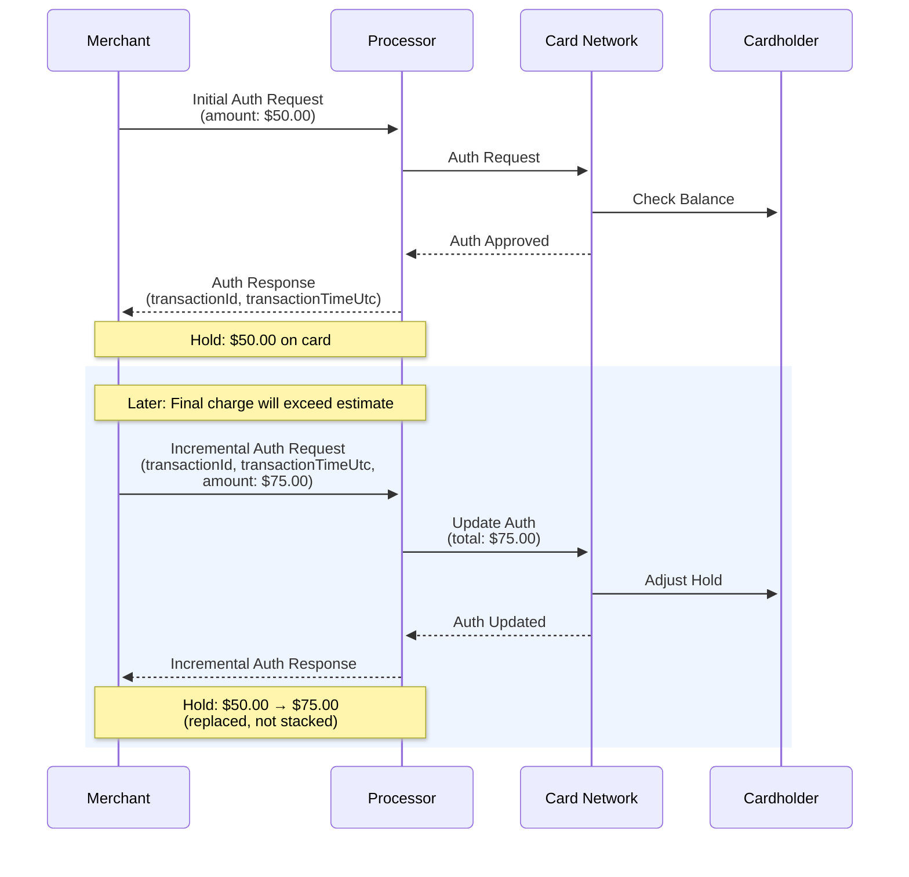

增量授权（Incremental Authorization）会在不关闭交易的情况下提高现有预授权的预留金额。
当预计最终收费将超过原始授权金额时可使用此功能，例如电动汽车充电时长超出最初预估的情况。

## 工作原理

Incremental Auth 会针对现有交易发送一个新的授权请求。`amount` 字段表示
新的授权总金额，而不是增量差值。如果您已授权 $50，现在希望预留 $75，则应发送 `75.00`。

该请求通过原始 Auth 响应中的两个字段 `transactionId`
和 `transactionTimeUtc` 与原始交易关联。这两个字段均为必填项。处理机构会使用它们来定位并更新现有的预留。

此调用完成后，处理机构会对持卡人预留 $75.00。原始的 $50.00 预留会被替换，而不是叠加。

流程如下所示：



## 要求

Send the following request body to [`POST /close-transaction`](/reference/ecom/payments/close-transaction) to submit an Incremental Auth:

```json
{
  "basicInfo": {
    "requestType": 6,
    "entryMode": 1,
    "amount": 75.00,
    "currency": "USD",
    "countryCode": "US",
    "merchantRequestId": "INCR_AUTH_REQ_001",
    "transactionId": "ORIGINAL_NAYAX_TRX_12345",
    "transactionTimeUtc": "2026-03-18T15:00:00Z"
  },
  "machineInfo": {
    "machineId": "1001578171"
  },
  "cardHolderInfo": {},
  "paymentInfo": {},
  "additionalInfo": {},
  "validationKey": "<your-validation-key>"
}
```

### 参数

下表说明了请求正文中每个必填字段：

| 范围                 | 类型       | 描述                          | 必需的 |
| ------------------ | -------- | --------------------------- | --- |
| requestType        | Int32    | 对于 Incremental Auth 必须为 `6` | 必需的 |
| 数量                 | 小数       | 新的授权总金额，而非增量差值              | 必需的 |
| 交易 ID              | String   | 来自原始 Auth 响应的 Nayax 交易 ID   | 必需的 |
| transactionTimeUtc | DateTime | 来自原始 Auth 响应的 UTC 时间戳       | 必需的 |
| merchantRequestId  | String   | 此增量授权请求的新唯一 ID              | 必需的 |
| 验证密钥               | String   | 用于请求身份验证的 HMAC 密钥           | 必需的 |

## 回复

验证成功将返回 `200 OK` 状态，以及包含已验证商户详细信息的正文：

```json
{
  "status": {
    "verdict": "Approved",
    "code": 0,
    "statusMessage": "Payment processed successfully."
  },
  "basicInfo": {
    "amount": 25.5,
    "currency": "EUR",
    "merchantRequestId": "MERCHANT_MIT_001",
    "transactionId": "NAYAXTRANS98765",
    "transactionTimeUtc": "2025-08-28T10:30:00Z"
  },
  "paymentInfo": {
    "amount": 25.5,
    "currency": "EUR",
    "nayaxTokenId": "NAYAXTOK12345",
    "siteId": 1,
    "providerTransactionId": "PSP_TRANS_ABC",
    "decimalPlace": 2
  }
}
```

### 响应参数

下表说明了响应的参数：

| 范围                      | 地点     | 类型       | 描述                                              |
| :---------------------- | :----- | :------- | :---------------------------------------------- |
| `verdict`               | status | String   | 'Approved' 或 'Declined'。最终判定结果。                 |
| `code`                  | status | Int32    | 响应代码：0 表示已批准，否则为相应的拒绝代码。                        |
| `statusMessage`         | status | String   | 有关交易结果的描述性消息。                                   |
| `amount`                | 基本信息   | 小数       | 已处理的交易金额。                                       |
| `currency`              | 基本信息   | String   | 交易的货币。                                          |
| `merchantRequestId`     | 基本信息   | String   | 原始请求中的唯一 ID。                                    |
| `transactionId`         | 基本信息   | String   | 由 Nayax 系统分配的唯一交易 ID。                           |
| `transactionTimeUtc`    | 基本信息   | DateTime | 交易完成时的 UTC 时间戳。                                 |
| `nayaxTokenId`          | 支付信息   | String   | 用于本次扣款的 token ID。                               |
| `siteId`                | 支付信息   | Int32    | 与本次付款关联的站点 ID。                                  |
| `providerTransactionId` | 支付信息   | String   | 由支付服务提供商（Payment Service Provider，PSP）分配的唯一 ID。 |
| `decimalPlace`          | 支付信息   | Int32    | 该货币/金额所使用的小数位数。                                 |

<Tip>
  `transactionId` 和 `transactionTimeUtc` 必须来自原始 Auth 响应，而不是预授权或任何中间请求。
  使用错误的值将导致处理机构拒绝该请求。
</Tip>
