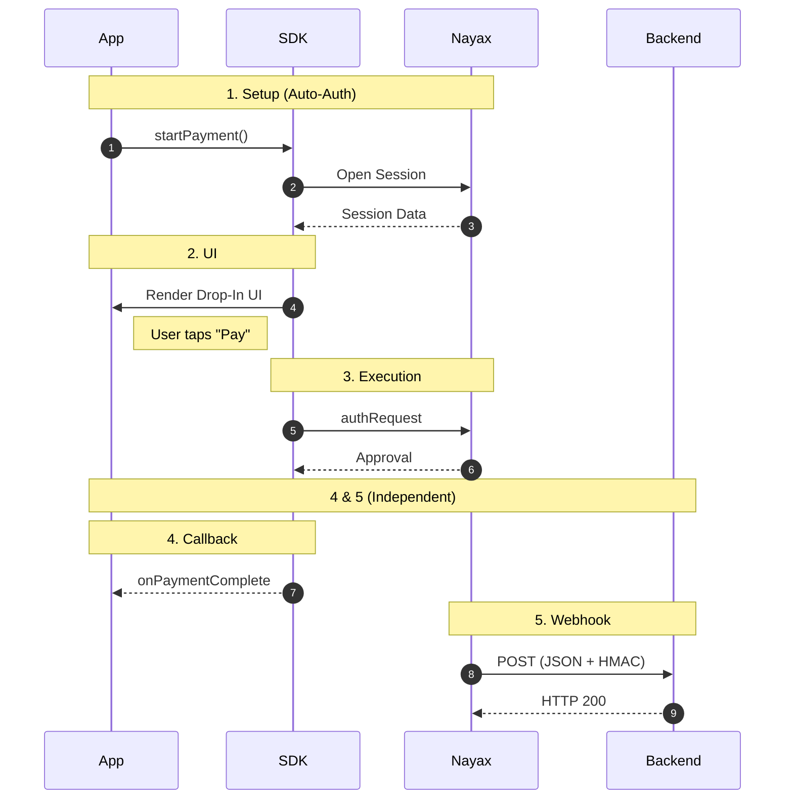

前端 SDK 使您能够将支付页面集成到您的应用程序中，而无需直接处理复杂的支付处理或安全事宜。它通过提供几个用于安全显示和交互支付页面的关键方法，简化了前端支付体验。同时，Nayax 在后台管理与账单提供商之间的复杂交互。

## 付款流程

下图描述了前端集成的典型支付流程。

<a
  href="/images/ecom-front-end-integration.png"
  download="ecom-front-end-integration.png"
  style={{
  display: 'inline-flex',
  alignItems: 'center',
  gap: '8px',
  padding: '8px 16px',
  backgroundColor: '#6352E0',
  color: 'white',
  borderRadius: '6px',
  fontWeight: '500',
  fontSize: '14px',
  textDecoration: 'none',
  cursor: 'pointer'
}}
>
  ↓ 下载图表
</a>

以下是该图表的详细说明：

1\. 设置

Your app calls [`startPayment (PaymentData)`](/docs/ecom-sdk/front-end-integration/ecom-sdk-create-payments) once. The SDK handles merchant authentication and session initialization with Nayax automatically. No additional API calls needed from your side.

2\. 界面

The SDK renders the [Drop-In UI](/docs/ecom-sdk/front-end-integration/drop-in-ui/index), a ready-made payment screen, directly inside your app. The cardholder enters their card details and taps Pay. Your app never touches raw card data.

3\. 执行

The SDK submits the authorization request to Nayax. The server responds with an approval or decline based on the [`requestType`](/docs/ecom-sdk/front-end-integration/ecom-sdk-create-payments) you specified (Sale, Auth, or Capture).

4\. 回调

The SDK fires a [callback](/docs/ecom-sdk/front-end-integration/handling-payment-results) (`onPaymentComplete`, `onPaymentFail`, or `onError`) depending on the outcome. Handle these in your app to update the UI and your local order state.

5\. Webhook

Once the transaction is processed, Nayax automatically sends the result to your back-end as a [webhook notification](/docs/ecom-sdk/back-end-integration/webhook-notifications), a JSON payload containing the transaction status, card details, and your original `merchantRequestId`. Validate the [`Hmac`](/docs/ecom-sdk/hmac-validation/index) field before processing, then return `HTTP 200` to confirm receipt. This is your authoritative record of the transaction.

## 可用指南

<Columns cols={3}>
  <Card icon="link" title="创建付款" href="/docs/ecom-sdk/front-end-integration/ecom-sdk-create-payments" />

  <Card icon="link" title="处理支付结果" href="/docs/ecom-sdk/front-end-integration/handling-payment-results" />

  <Card icon="link" title="Drop-In UI" href="/docs/ecom-sdk/front-end-integration/drop-in-ui/index" />
</Columns>
